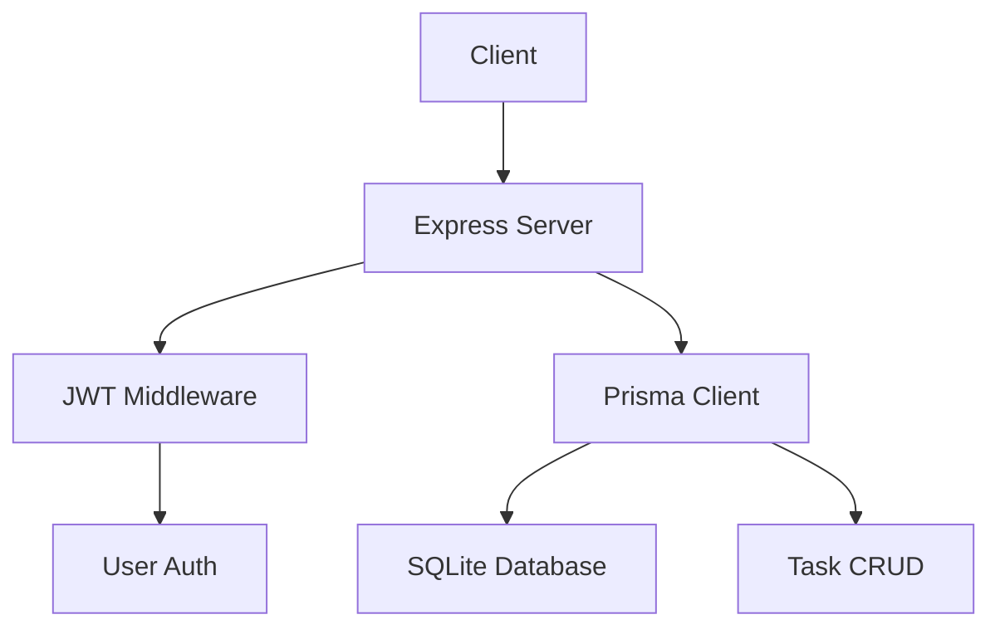

# Task Manager API

REST API для управления задачами с аутентификацией JWT. Node.js + TypeScript + Express + Prisma + SQLite.

## Архитектура



## Endpoints

| Method | Endpoint | Description | Auth |
|--------|----------|-------------|------|
| POST | /auth/register | Регистрация пользователя | Нет |
| POST | /auth/login | Вход, получение JWT | Нет |
| GET | /tasks | Получить все задачи пользователя | JWT |
| POST | /tasks | Создать задачу | JWT |
| PUT | /tasks/:id | Обновить задачу (toggle completed) | JWT |
| DELETE | /tasks/:id | Удалить задачу | JWT |
| GET | /health | Проверка здоровья | Нет |

## Метрики (Day 1)

- ✅ 5 CRUD операций работают
- ✅ JWT аутентификация
- ✅ SQLite база данных
- ✅ Docker контейнеризация
- ✅ GitHub Actions CI/CD

## Установка

1. Клонировать репозиторий
2. `npm install`
3. `npx prisma generate`
4. `npx prisma migrate dev --name init`
5. `npm run dev`

## Docker

```bash
docker-compose up --build
```

## Тестирование

```bash
# Регистрация
curl -X POST http://localhost:3000/auth/register \
  -H "Content-Type: application/json" \
  -d '{"email":"test@test.com","password":"123456"}'

# Вход
curl -X POST http://localhost:3000/auth/login \
  -H "Content-Type: application/json" \
  -d '{"email":"test@test.com","password":"123456"}'

# Получить задачи (с токеном)
curl -X GET http://localhost:3000/tasks \
  -H "Authorization: Bearer YOUR_TOKEN"
```

## Roadmap

- Day 1: Фиксы + Docker + CI
- Day 2-7: NestJS миграция
- Day 8-15: GraphQL + WebSocket
- Day 16-30: Масштабирование (Redis, тесты, Railway)